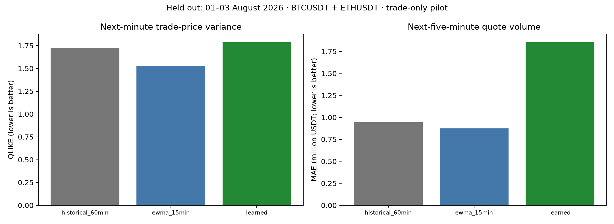
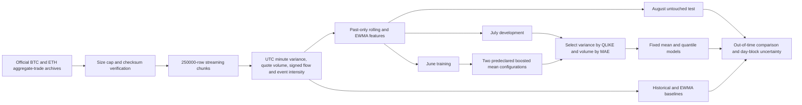
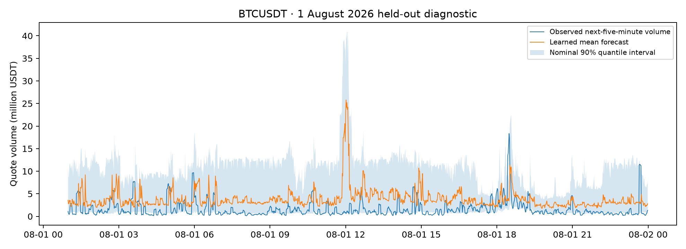

# FlowRisk — Trade-Flow Forecasting

FlowRisk studies a practical execution-research question: how much can recent trade flow tell us about the next minute's price variation and the next five minutes' traded volume? It turns actual Binance aggregate-trade records into a chronological forecasting benchmark, rather than presenting a hypothetical profitable trading strategy.

The project compares historical and exponentially weighted forecasts with trained gradient-boosted mean and quantile models. It records out-of-time errors, uncertainty coverage and negative comparisons. **It uses trades, not order-book snapshots:** no spread/depth reconstruction, queue-position model, executable fill, market-impact estimate or profit claim is made.

The completed pilot's main finding is a failure of the learned models to beat simple adaptive baselines under the sampled calendar shift. EWMA wins both forecast tasks, and learned nominal 90% intervals substantially undercover. This result is retained as evidence about validation discipline, not hidden behind a profitable-backtest story.



## Technical snapshot

| Question | Implementation |
|---|---|
| What is predicted? | Next-minute squared log trade-price return sum; next-five-minute USDT quote volume |
| What is trained? | Histogram gradient-boosted positive-mean and 5th/50th/95th quantile regressors |
| Baselines | Historical 60-minute mean and 15-span EWMA |
| Data | Actual BTCUSDT and ETHUSDT spot aggregate trades from Binance's public daily archive |
| Leakage controls | Features use fully closed minutes only; contiguous-block warm-up; future labels; chronological partitions and six-minute label-end purge |
| Evaluation | MAE, RMSE, QLIKE for positive variance forecasts, pinball losses, interval coverage and paired UTC-day block uncertainty |
| Current scope | First three contiguous days of June, July and August 2026—not all three months |

## System flow

```text
Official archive HEAD-size preflight → capped downloads → publisher SHA-256 checks
  → bounded-memory CSV chunks → one-minute trade-flow aggregates
  → contiguous-block features → next-minute / next-five-minute targets
  → June training → July development selection → untouched August evaluation
  → baseline comparisons + quantile coverage + day-block uncertainty
```

## Architecture



### Data provenance and bounded scope

The [official Binance public-data repository](https://github.com/binance/binance-public-data) documents freely downloadable daily aggregate-trade archives, their columns and `.CHECKSUM` files. This run downloads **18 archives: two symbols × three days × three months**, with a 250 MiB compressed-download cap. Seven days per month were considered in a HEAD-only preflight but required about 603 MiB; the three-day scope was fixed **before training or viewing any forecast results**. The completed selection is June 1–3 for training, July 1–3 for development and August 1–3 for test. It is not a full-August or continuous-quarter benchmark.

All publisher archive checksums are validated. Exact URLs, sizes and SHA-256 values are stored in `outputs/provenance.json`. Raw downloads and minute/prediction data stay local and are excluded from Git. Spot timestamps from 2025 onward are microseconds, per the publisher's schema; this implementation uses that contract explicitly.

### Aggregation and causal feature construction

CSV processing uses 250,000-row chunks. The sum of squared consecutive log aggregate-trade-price returns forms each minute's variance proxy; cross-chunk price continuity is preserved. The first event of each daily archive has no preceding price and contributes zero return. This proxy is affected by trade-price microstructure noise and is **not** an efficient-midprice realized-variance estimate. A maker-buyer flag marks seller-initiated aggregate flow; signed quote volume is a trade-flow proxy, not resting-book imbalance. Intensity counts aggregate-trade events, not individual matched fills.

At the close of minute `t`, features use minute `t` and prior minutes only: 1/5/15/60-minute variance and volume means, EWMA, signed quote-flow ratios, event intensity, UTC time and symbol identity. Targets use variance in `t+1` and quote volume in `t+1…t+5`. Minute timestamps represent interval opens, so the last target closes at timestamp `t+6`. Missing monthly intervals reset warm-up rather than becoming artificial consecutive observations. Five trailing rows lack complete future labels and are removed from each contiguous segment.

### Models and evaluation protocol

Two configurations—7 versus 15 maximum leaves, 120 iterations, learning rate 0.05—are registered before evaluation. Mean models use Poisson deviance on rescaled nonnegative targets. July alone selects the variance configuration by QLIKE and volume configuration by MAE. Models are not refitted on July; August remains an out-of-time test. This first pilot is a **single chronological train/development/test exercise**, not a multi-fold walk-forward study.

Quantile regressors fit log-transformed targets at 0.05, 0.50 and 0.95 using the selected tree size. Row-wise rearrangement enforces monotonic quantiles; the raw outer-crossing rate is disclosed. A nominal 90% interval is not guaranteed to achieve 90% empirical coverage. No test-based calibration is performed. Paired block bootstrap resamples UTC days jointly across BTC and ETH; with only three held-out days, intervals are exploratory and cannot support strong significance claims.

## Measured results

The completed run processes **15,810,312 real aggregate-trade events** from 18 checksum-verified archives, using **225.4 MiB compressed downloads**. They produce 25,920 symbol-minute observations. Warm-up and incomplete future-target removal leave **8,512 training / 8,512 development / 8,512 test rows**, with 4,256 held-out forecast origins per symbol. Overlapping five-minute targets are not independent examples.

| Model | Next-minute variance QLIKE ↓ | Next-five-minute volume MAE ↓ |
|---|---:|---:|
| Historical 60-minute mean | 1.7208 | 946,670 USDT |
| **15-span EWMA** | **1.5263** | **875,289 USDT** |
| Trained gradient boosting | 1.7888 | 1,856,157 USDT |

**The learned mean models underperform EWMA on both tasks.** July selected the seven-leaf configuration for each task; neither test table was used to change that choice. The learned-minus-EWMA day-block difference is **+0.2625 QLIKE** (exploratory 95% interval −0.0725 to +0.7019) and **+980,868 USDT volume MAE** (+532,802 to +1,438,302). Only three held-out daily blocks support these intervals, so they should not be treated as robust significance estimates.

The learned nominal 90% quantile intervals cover just **69.73% of variance targets** and **55.51% of volume targets**. There were no raw outer-quantile crossings. Pinball losses and widths are reported rather than assuming nominal coverage was achieved. Both point error and severe undercoverage matter for practical risk-aware scheduling.

The sampled periods differ sharply: average one-minute BTC quote volume falls from approximately **1.38 million USDT in the June sample to 0.46 million in August**, and ETH from **0.67 million to 0.18 million**. This is consistent with a substantial distribution shift, but the experiment does not isolate its cause or prove that shift alone explains the model failure. The adaptive baselines use recent fully closed observations while the learned model's parameters remain fixed after June training.



Evidence: [`results.json`](outputs/results.json), [`all development attempts`](outputs/experiments.json), [`split manifest`](outputs/split-manifest.json), [`archive provenance`](outputs/provenance.json) and [`aggregation counts`](outputs/aggregation.json). Nine contract tests pass; the suite exercises future-target direction, feature causality, gap resets, purging and metric boundaries using synthetic unit inputs separate from real reported metrics.

## Reproduce

```bash
python3.12 -m venv .venv
source .venv/bin/activate
pip install -r requirements.txt
python flowrisk.py fetch --days 3 --max-mb 250
python flowrisk.py aggregate
python flowrisk.py train
python -m pytest -q
```

No account, API key, paid data, order submission or trading connection is required. Download concurrency is four network workers; numerical computation is limited to two CPU threads. Model checkpoints are local under `models/`; run training to recreate them. The exact environment is recorded in `requirements-lock.txt`.

## Limitations and next experiments

- Only BTC/ETH at one crypto venue and the first three days of three months. Weekend/calendar effects and regime gaps limit generalization; no equity-market claim follows.
- The final test has only three independent daily blocks. Expand to the complete quarter and multiple rolling-origin folds before drawing robust statistical conclusions.
- Trades do not establish executable prices, spreads, book depth, queue priority, fees, slippage or market impact. Forecast quality is not trading profitability.
- USDT quote volume is not guaranteed equivalent to USD volume; all reported currency quantities remain denominated in USDT.
- A variance proxy from transaction prices contains microstructure noise; zero or tiny targets require a documented positive numerical floor in QLIKE.
- Static hyperparameters and one seed; no regime-specific retuning or alternative target definitions were selected on test results.
- Archive history can be revised; compare stored checksums before rerunning. Publisher data terms remain separate from this repository's original MIT-licensed code.

## Sources and licence

[Binance public data documentation](https://github.com/binance/binance-public-data) and [public archive](https://data.binance.vision/). Original project code is MIT licensed. Third-party raw data are not redistributed; consult the publisher's terms before further use.
